# Dynamic Quality Estimation of Wireless Links with Autonomous Agents

This repository contains the thesis document, final presentation, and simulation results associated with my Master's Thesis, which focused on researching, implementing, and comparing methods to enhance the reliability and efficiency of wireless networks with UAVs. This involved designing a model change detector to detect changes in link Packet Delivery Ratio (PDR) model parameters and proposing an estimation error metric.

	<a href="doc/Dynamic_Quality_Estimation_of_Wireless_Links_with_Autonomous_Agents.pdf">Thesis</a>
	 • 
	<a href="doc/presentation.pdf">Presentation</a>
	 • 
	<a href="results">Simulation Results</a>
	 • 
	<a href="#sample-images">Sample Images</a>

     

## Abstract

Wireless Sensor Networks (WSNs) have become increasingly prevalent in various fields such as environmental monitoring, surveillance, and industrial automation. These networks consist of nodes with limited resources that wirelessly communicate to stream sensor data to a ground station. Packet Delivery Ratio (PDR) is a performance metric that evaluates a network quality of service (QoS) by measuring the proportion of successfully delivered packets to their destination among all packets sent. A high PDR value indicates efficient packet delivery, while a low PDR value indicates poor performance due to packet loss.

Relay nodes play a crucial role in Wireless Sensor Networks by forwarding data from a source node, such as a sensing node, to a destination, such as a ground station. The proper placement of these relay nodes can significantly impact the network overall performance. In particular, for the operation of autonomous agents, such as unmanned aerial vehicles (UAVs) in Flying Ad-hoc NETworks (FANETs), efficient relay placement and robust wireless communication are crucial.

This thesis investigates the online dynamic estimation of wireless link quality using autonomous agents, with a focus on detecting changes in the link models. Additionally, the thesis presents and compares various relay placement strategies in complex scenarios to optimize the network PDR. Three relay placement strategies are proposed for wireless line networks: equidistant placement, equal-PDR placement, and optimal placement, which maximizes the overall network PDR. The study also compares the strategies in different simulated scenarios. The findings show that the optimal placement strategy outperforms the others and is considered the recommended strategy for relay placement in any wireless line network.

_Keywords:_ wireless communication, line network, channel model, packet delivery ratio, PDR, model change detection, unmanned aerial vehicle, UAV

## Sample Images

A selection of key images from the project:

#### Context

    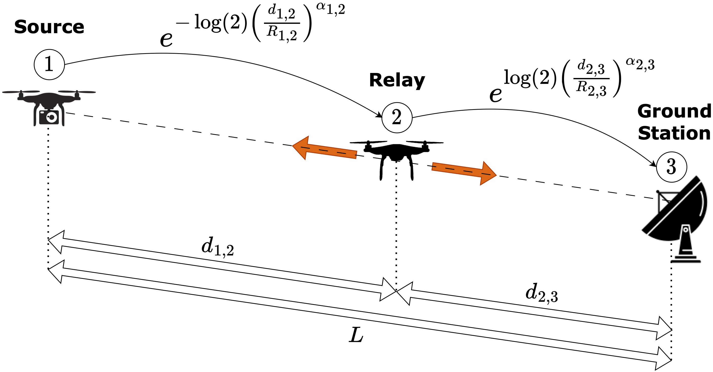 

#### Introduction to Relay Placement Problem

     

#### Line Network Weighted Graph

    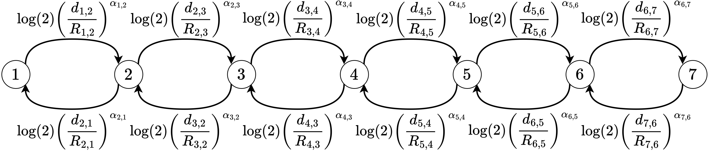 

### Some Achieved Results

#### Estimates of PDR Model Parameters

    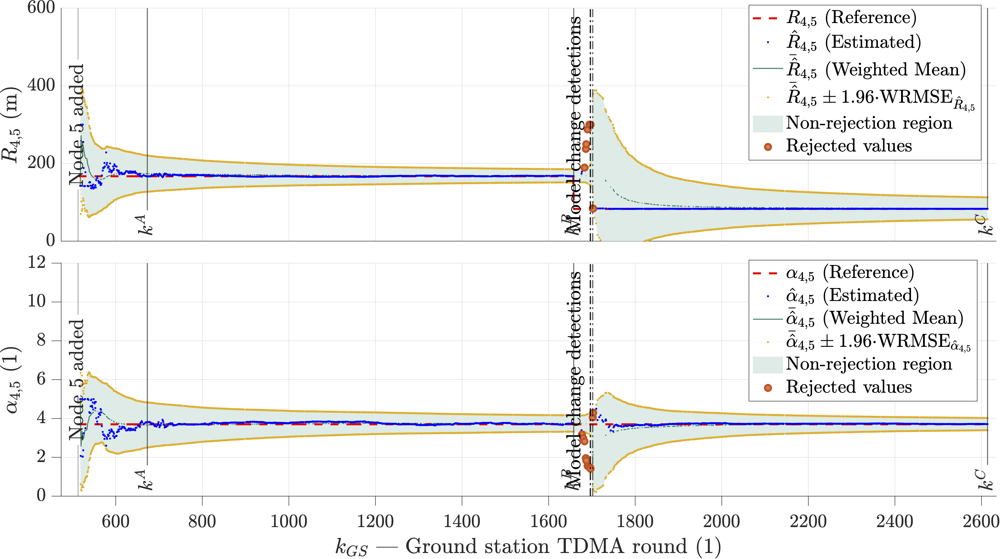 

#### Estimated vs. Actual Link Models

    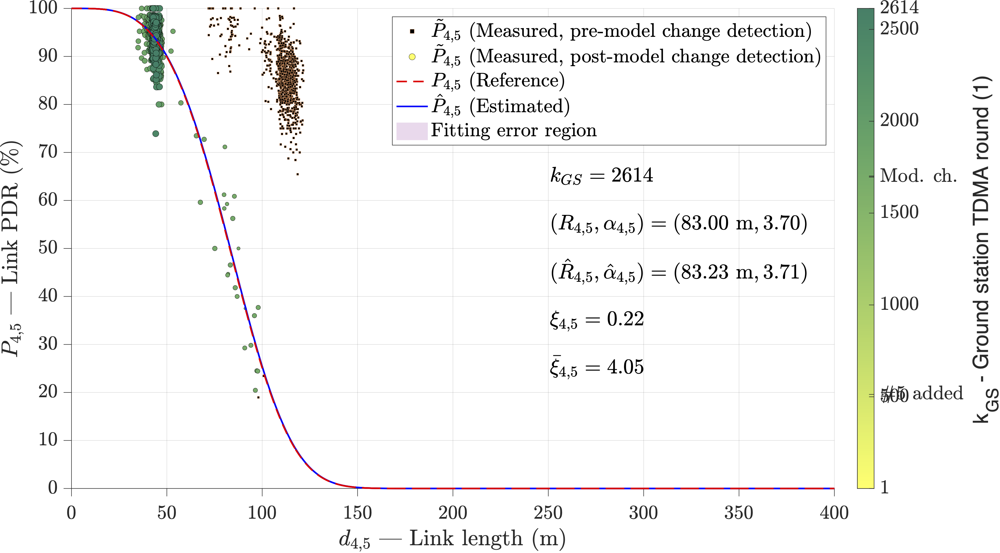 

    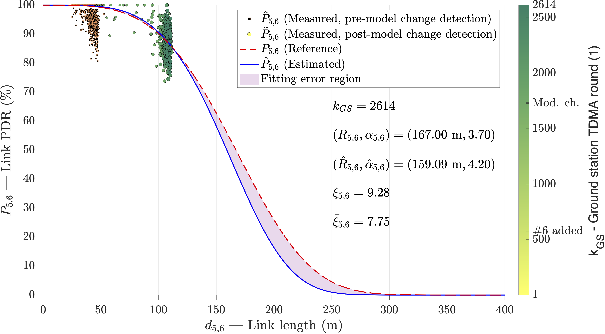 

#### Time Evolution of the Estimated Link Models

    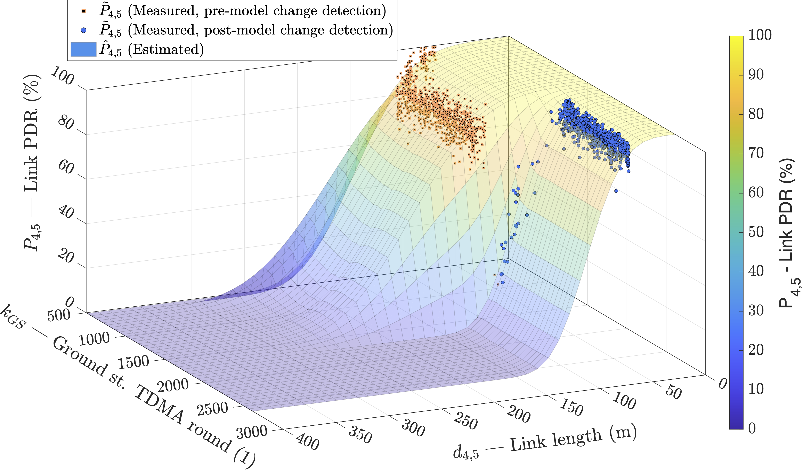 

    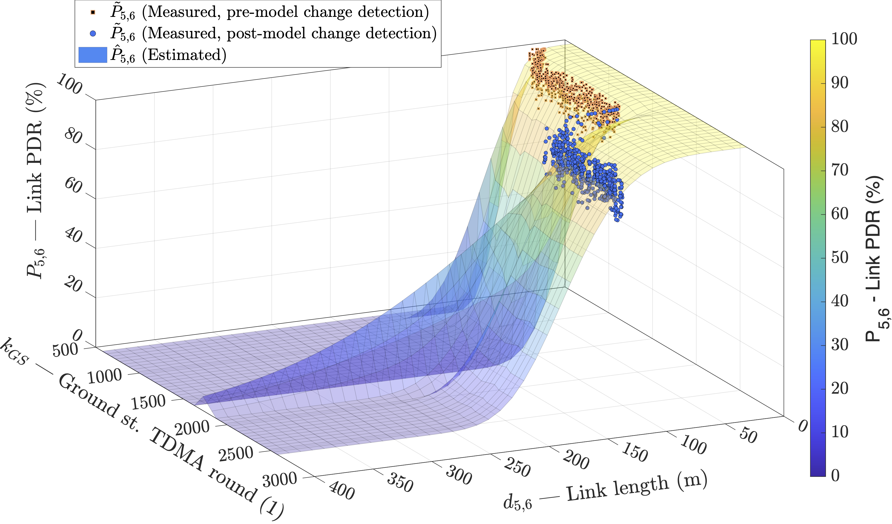 

#### Simulation Environment
It depicts the placement of UAVs (source and relays) and ground station nodes, with blue and red regions indicating areas where link PDR model parameters change (degrade and improve, respectively)

    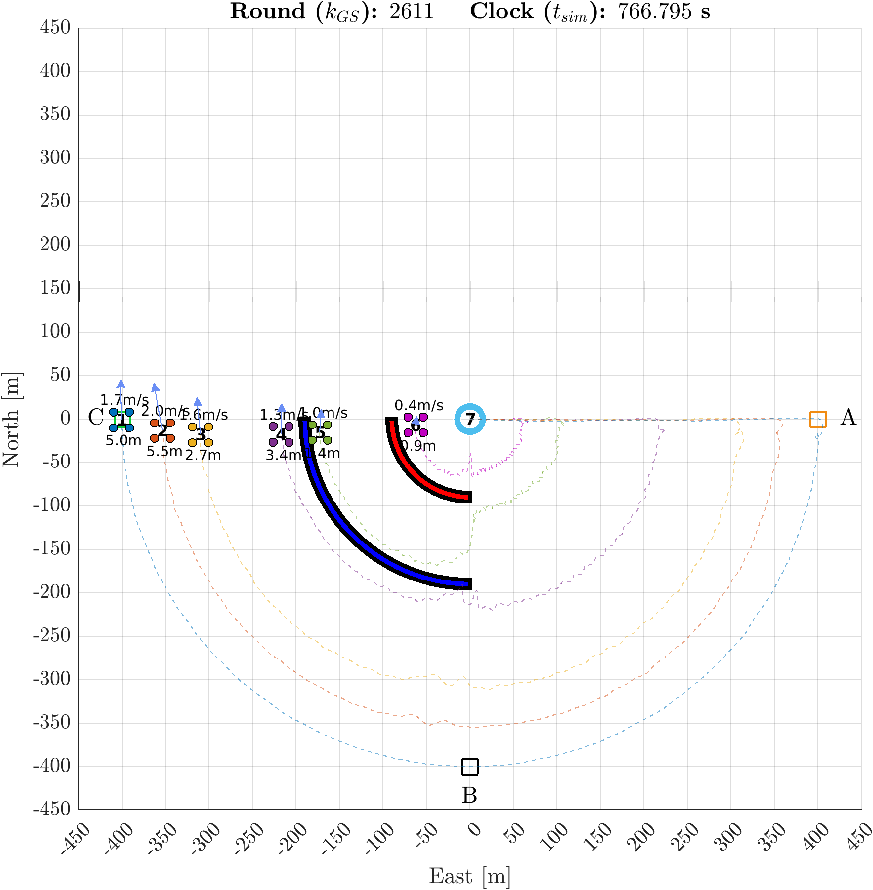 

#### Link and Network PDRs

    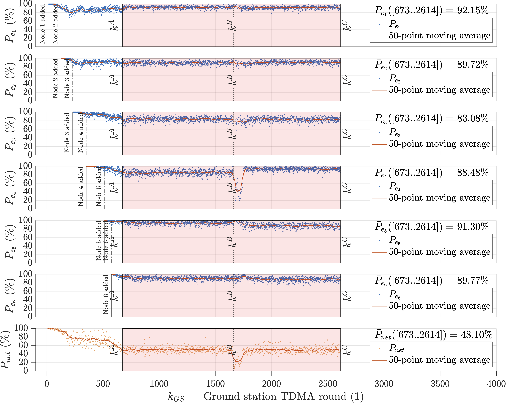 

    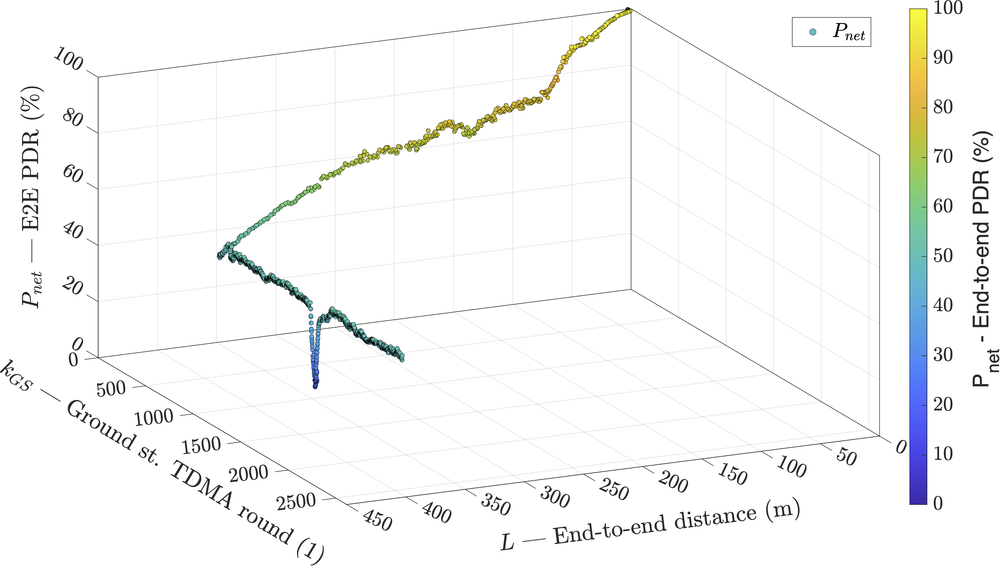 

#### Relay Placement Strategies Comparison
Comparing average network PDR in different scenarios

    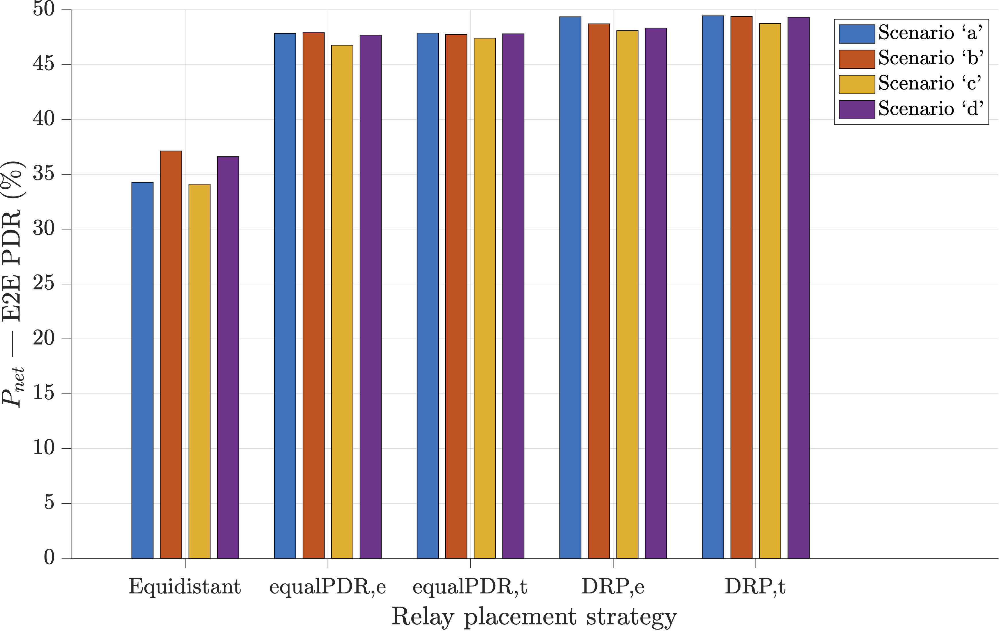 

