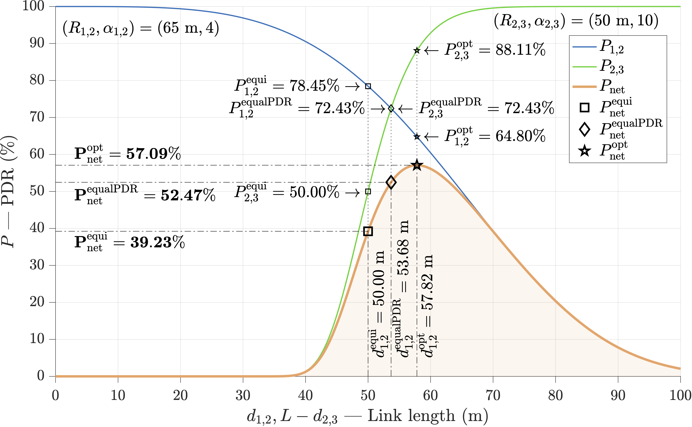

# Dynamic Quality Estimation of Wireless Links with Autonomous Agents

This repository contains the thesis document, final presentation, and simulation results associated with my Master's Thesis, which focused on researching, implementing, and comparing methods to enhance the reliability and efficiency of wireless networks with UAVs. This involved designing a model change detector to detect changes in link Packet Delivery Ratio (PDR) model parameters and proposing an estimation error metric.

	<a href="doc/Dynamic_Quality_Estimation_of_Wireless_Links_with_Autonomous_Agents.pdf">Thesis</a>
	 • 
	<a href="doc/presentation.pdf">Presentation</a>
	 • 
	<a href="results">Simulation Results</a>
	 • 
	<a href="#sample-images">Sample Images</a>

     

## Abstract

Wireless Sensor Networks (WSNs) have become increasingly prevalent in various fields such as environmental monitoring, surveillance, and industrial automation. These networks consist of nodes with limited resources that wirelessly communicate to stream sensor data to a ground station. Packet Delivery Ratio (PDR) is a performance metric that evaluates a network quality of service (QoS) by measuring the proportion of successfully delivered packets to their destination among all packets sent. A high PDR value indicates efficient packet delivery, while a low PDR value indicates poor performance due to packet loss.

Relay nodes play a crucial role in Wireless Sensor Networks by forwarding data from a source node, such as a sensing node, to a destination, such as a ground station. The proper placement of these relay nodes can significantly impact the network overall performance. In particular, for the operation of autonomous agents, such as unmanned aerial vehicles (UAVs) in Flying Ad-hoc NETworks (FANETs), efficient relay placement and robust wireless communication are crucial.

This thesis investigates the online dynamic estimation of wireless link quality using autonomous agents, with a focus on detecting changes in the link models. Additionally, the thesis presents and compares various relay placement strategies in complex scenarios to optimize the network PDR. Three relay placement strategies are proposed for wireless line networks: equidistant placement, equal-PDR placement, and optimal placement, which maximizes the overall network PDR. The study also compares the strategies in different simulated scenarios. The findings show that the optimal placement strategy outperforms the others and is considered the recommended strategy for relay placement in any wireless line network.

_Keywords:_ wireless communication, line network, channel model, packet delivery ratio, PDR, model change detection, unmanned aerial vehicle, UAV

## Sample Images

A selection of key images from the project:

#### Context: Linear network with One Source, One or More Relays, and One Ground Station
The communication network in question consists of a linear arrangement of nodes, which includes one source node, one or more relay nodes, and one ground station node. The exact number of relay nodes may vary, depending on the specific network configuration.

The network topology can be represented by an oriented graph, where the nodes represent the communication points, and the edges represent the links between them. The link Packet Delivery Ratio, denoted by _Pi,j_, is the probability that a packet sent from node _i_ will be successfully received by node _j_. This probability depends on the length of each link, denoted by _di,j_, as well as two parameters:

* _Ri,j_: the link length at which the delivery ratio is 50%
* _αi,j_: the steepness of the curve that characterizes how quickly the link PDR decreases with increasing link length
In other words, the link PDR decreases as the distance between the nodes increases, and the rate of this decrease is determined by the αi,j parameter. A larger value of _αi,j_ means the PDR decreases more steeply with increasing link length.

By analyzing these parameters for each link in the network, we can better understand the network performance and identify potential bottlenecks or areas for improvement.

While the figure shows a dual-link network with one source, one relay, and one ground station, the same concepts apply to the linear network with one source, one or more relays, and one ground station.

     

The placement of the relay has a direct impact on the network PDR (_Pnet_), which is why finding a good placement is crucial in improving the network performance.

#### Introduction to Relay Placement Problem
In a line network, the Packet Delivery Ratio of the entire network, denoted by _Pnet_, can be calculated as the product of the individual link PDRs, under certain assumptions. This means that the probability of a packet sent from the source node being successfully received by the ground station is dependent on the success rate of each link in the network. By optimizing the PDR of each link, we can improve the overall performance of the network.

The dual-link network in the figure below is composed of 1 source, 1 relay, and 1 ground station. The 2 link PDRs _P1,2_ and _P2,3_ are represented by the blue line (with parameters
(_R1,2_, _α1,2_) = (65 m, 4)) and the green line (with parameters (_R2,3_, _α2,3_) = (50 m, 10)), while the orange line represents their product, _Pnet_. The area under _Pnet_ is shaded in orange.

     

#### Oriented Weighted Graph of a Line Network
Represented in the figure below: 1 source, 5 relays, and 1 ground station.

     

### Some Achieved Results

#### Estimates of Link PDR Model Parameters

     

#### Estimated vs. Actual Link PDR Models

     

     

#### Time Evolution of the Estimated Link PDR Models

     

     

#### Simulation Environment
The graphical visualizer shows the main waypoints – ‘A’, ‘B’, and ‘C’ – that the source passes through during successive TDMA rounds, as recorded by the ground station with a log file. The bigger, encircled values represent the node UIDs, whereas the values located above the nodes represent their speed values (in m/s), and the values located below represent their altitude values (in m).
Finally, the blue and red regions indicate areas where link PDR model parameters change (degrade and improve, respectively).

     

#### Link and Network PDRs

     

     

#### Relay Placement Strategies Comparison
Comparing average network PDR of different relay placement strategies in different scenarios:

     

